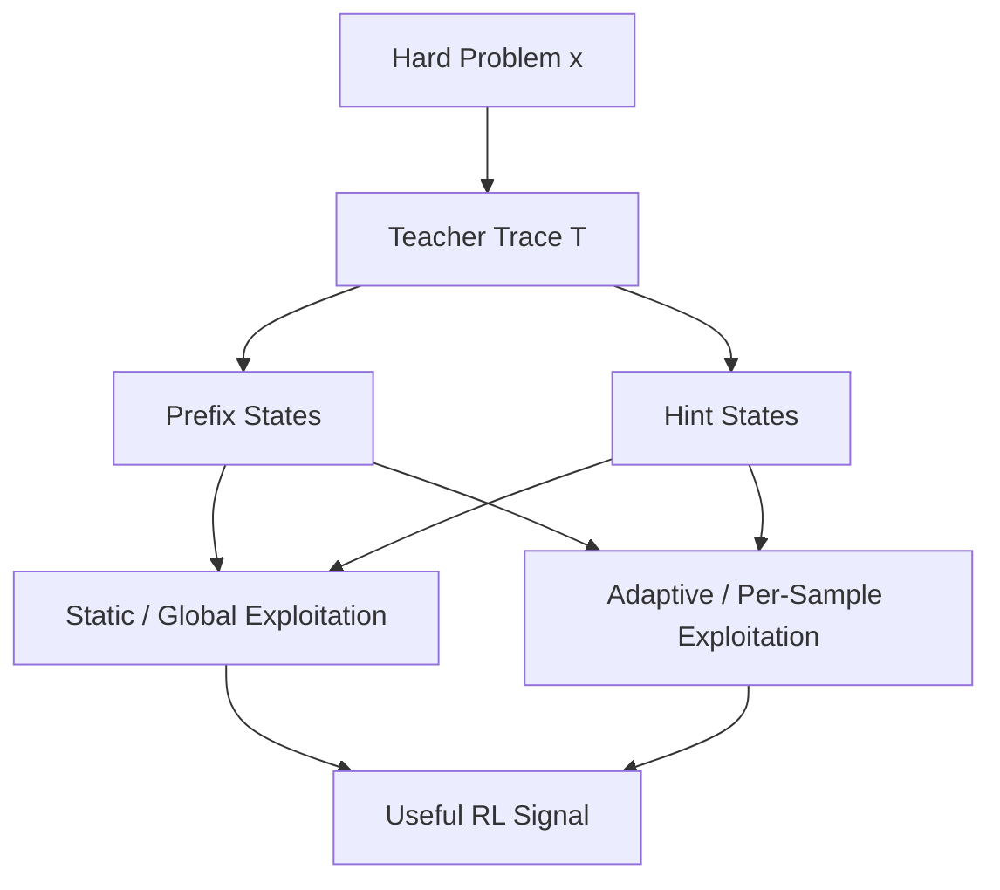

# Research Plan Outline

## Working Title
**One Hard Problem, Many Learnable States: Teacher-Guided State Expansion for Data-Efficient RL Reasoning**

Alternative short title:
**Teacher-Guided State Expansion for Data-Efficient RL Reasoning**

---

## 1. Core Motivation

### 1.1 The real bottleneck is not only "data quantity"
RL for reasoning is not primarily bottlenecked by the raw number of available problems, but by the scarcity of **useful training signal**.

- Easy problems quickly saturate and stop producing informative GRPO updates.
- Very hard problems are valuable, but often induce near-zero reward and reward collapse.
- Thus, the practical bottleneck is the scarcity of **learnable training states**, not merely the scarcity of raw questions.

This perspective aligns with recent data-centric RL work:

- **LILO** shows that questions with high reward variance maximize expected policy improvement.
- **Hard Examples Are All You Need** shows that harder questions can be much more useful than easy ones under fixed annotation budgets.
- **Goldilocks RL** and **SEELE** both emphasize matching effective task difficulty to model capability.

However, these works study standard RL or hint-based difficulty control. They do not ask:

> Can teacher traces transform one hard question into multiple learnable training states, and can curriculum RL exploit this efficiently?

### 1.2 Why curriculum RL is both promising and expensive
Curriculum RL methods such as AdaBack show that partial teacher supervision can expand the model's reasoning boundary. But this comes with a hidden cost:

- each original sample must be revisited many times,
- each revisit occurs under a different supervision level,
- and only some of those supervision states are actually learnable.

This suggests a new viewpoint:

> The main cost of curriculum RL is not just rollout generation; it is spending compute on supervision states that are outside the model's learnable zone.

This leads to the central question of this project:

> Can we design teacher-guided curriculum RL so that a small set of hard problems yields a disproportionately large amount of useful RL signal?

---

## 2. Core Conceptual Shift

### 2.1 Teacher guidance is not just "help"
A teacher trace does more than make a hard question easier. It induces a family of guided states over the same underlying problem.

Given a hard problem `x` and a teacher trace `T = {s1, s2, ..., sL}`, we can construct multiple guided states:

- **Prefix mode**:
  - `(x, prefix_1)`
  - `(x, prefix_2)`
  - ...
  - where the student completes the remaining reasoning

- **Hint mode**:
  - `(x + hints_1)`
  - `(x + hints_2)`
  - ...
  - where the student still solves the full problem, but under varying levels of guidance

These are not new semantic problems, but they are new **trainable reasoning states**.

### 2.2 Teacher-guided state expansion
We therefore define the central object of study as:

> **Teacher-guided state expansion**: the process by which one hard reasoning problem is transformed into a set of guidance-conditioned training states with different effective difficulty.

This wording is preferable to strict `data augmentation`, because:

- it avoids claiming that we generate new semantic tasks,
- it matches RL language (states, trajectories, start-state variation),
- and it naturally covers both prefix and hint modes.

### 2.3 Difficulty trajectories
For a fixed problem `x`, different guidance budgets induce a sequence of effective difficulties:

`x_g1 -> x_g2 -> ... -> x_g0`

where `g` controls how much teacher information is exposed.

This gives each original question a **guidance-conditioned difficulty trajectory**.

Teacher guidance mode determines the shape of this trajectory:

- **Prefix mode**:
  - strong reduction in difficulty at high guidance,
  - but often a sharp transition as guidance is removed,
  - likely a narrower learnable window

- **Hint mode**:
  - weaker but smoother reduction in difficulty,
  - preserves full-solution generation throughout,
  - likely a wider learnable window

Curriculum strategy then determines how these trajectories are traversed:

- **Static / global mixture**:
  - exploit the expanded state space by mixing guided states offline
- **Adaptive / per-sample curriculum**:
  - exploit the expanded state space online by moving each sample along its trajectory

This gives a unified picture:



---

## 3. Paper-Level Thesis

### 3.1 Main thesis
Teacher guidance can convert a small set of hard reasoning questions into a much richer set of learnable training states. Curriculum RL is valuable because it provides a mechanism for exploiting this expanded state space efficiently.

### 3.2 Stronger version of the claim
Under a fixed compute and model budget:

- a **small, hard, teacher-guided** dataset
- combined with an appropriate exploitation strategy

can match or exceed:

- a much larger **unguided** dataset
- trained with standard GRPO

If validated, this implies that:

1. teacher guidance acts as an effective **state-space amplifier**,
2. curriculum RL can alleviate the **small high-quality training set problem**,
3. and the resulting system offers a practical recipe for data-efficient RL reasoning.

---

## 4. Research Questions

### RQ1: Does teacher guidance produce effective state expansion?
Can teacher guidance transform hard questions into multiple states that fall into the model's learnable zone?

### RQ2: Which guidance mode produces better state expansion?
Does prefix mode or hint mode generate more useful learnable states?

### RQ3: How should the expanded state space be exploited?
Is static/global mixture sufficient, or is adaptive/per-sample traversal materially better?

### RQ4: Can small guided data compete with large unguided data?
Can a small hard set with teacher-guided state expansion match or outperform a much larger standard GRPO training set?

### RQ5: Can we derive a practical recipe?
Can we turn the empirical findings into a reproducible pipeline for data-efficient RL reasoning?

---

## 5. Relation to Existing Work

### 5.1 What is already known

| Work | What it establishes |
|------|---------------------|
| **AdaBack** | Per-sample partial supervision can outperform standard RL and SFT+RL |
| **LILO** | Learnability / reward variance is a key criterion for efficient RL sample selection |
| **Hard Examples** | Harder examples can be better training data for GRPO |
| **SEELE** | Adaptive hints can keep training in an efficient difficulty regime |

### 5.2 The gap
No work currently provides a unified view that connects:

- **hard-problem data scarcity**
- **teacher traces as learnable-state expansion**
- **guidance mode design**
- **static vs adaptive exploitation of the expanded state space**

This is the conceptual gap we aim to fill.

### 5.3 Why this is not just "another AdaBack paper"
AdaBack proves that adaptive partial supervision can help. Our project asks a different question:

> What is the underlying object that teacher guidance creates, and how should we exploit it under realistic data and compute constraints?

That shifts the paper from:
- "a better curriculum algorithm"

to:
- "a broader account of how teacher guidance creates RL training signal"

---

## 6. Data Assets

### 6.1 Available dataset
We already have:

- **11,303 olympiad-level math problems**
- teacher traces with explicit step boundaries
- Qwen3-1.7B **pass@32** difficulty scores

Difficulty buckets:

- **Trivial**
- **Easy**
- **Medium**
- **Hard**
- **Impossible**

This is a strong foundation because it gives us:

1. raw difficulty
2. a pool of high-value hard questions
3. a way to construct curated small-data training sets

### 6.2 Why this dataset is uniquely valuable
Most related work uses benchmark-native train splits as-is. We instead have a precomputed difficulty landscape, which enables:

- hard/frontier/random selection
- controlled low-data experiments
- direct measurement of "small guided vs large plain" comparisons

---

## 7. Core Empirical Program

We divide the empirical plan into four layers.

### 7.1 Layer A: Expansion validity (cheap, pre-training)
Goal: verify that teacher guidance really expands the set of learnable states.

#### Experiment A1: Guidance-conditioned learnability curves
Sample 100-200 hard/impossible problems. For each problem:

- evaluate no guidance
- evaluate multiple prefix budgets
- evaluate multiple hint budgets

Measure:

- pass@k or success rate under each guidance budget
- learnability proxy: `p(1-p)` where `p` is success rate

Desired result:

- many hard questions with near-zero no-guidance success should move into mid-range learnability under some guidance budgets

This is the first direct validation of state expansion.

#### Experiment A2: Effective learnable-state volume
Define a simple empirical quantity:

- `V(x) = number of guidance budgets where p(x,g) lies in a learnable interval`

Compare:

- prefix-mode `V_prefix(x)`
- hint-mode `V_hint(x)`

This gives a clean, low-cost characterization of which guidance mode creates a larger useful state space.

### 7.2 Layer B: Core training experiments
Goal: verify that small guided hard sets can rival larger unguided training.

#### Main datasets

- **Small-hard**: 800 hard/high-expansion-potential questions
- **Large-random**: 3200 randomly sampled questions
- optional: **Small-frontier** if we decide to distinguish raw hard from high-learnability

#### Core runs

1. **Large-random + GRPO**
2. **Small-hard + GRPO**
3. **Small-hard + SFT**
4. **Small-hard + static prefix exploitation**
5. **Small-hard + static hint exploitation**
6. **Small-hard + adaptive prefix exploitation**
7. **Small-hard + adaptive hint exploitation**

The key comparison is:

- `Small-hard + teacher-guided exploitation`
vs
- `Large-random + GRPO`

If the former matches or exceeds the latter, we have the main paper result.

### 7.3 Layer C: Mechanism experiments
Goal: explain *why* one guided setting works better.

#### Experiment C1: Prefix vs Hint
This is not an add-on. It is central because these are two different state-expansion operators.

Questions:

- Does prefix create stronger but narrower learning windows?
- Does hint create weaker but broader learning windows?
- Which leads to better final zero-guidance reasoning?

#### Experiment C2: Static vs Adaptive exploitation
This isolates whether per-sample curriculum is truly necessary.

- If static/global mixture already captures most of the gain, then the main contribution shifts toward state expansion itself.
- If adaptive/persample substantially outperforms static mixture, then curriculum remains an important exploitation mechanism.

This experiment also directly addresses the concern that global mixture may be the more natural user of expanded states.

### 7.4 Layer D: Transfer and robustness
Goal: ensure results are not too narrow.

#### Experiment D1: Second model scale
Run best setting plus core baselines on **Qwen3-0.6B**.

#### Experiment D2: External benchmarks
Evaluate trained models on:

- AIME24
- AIME25
- AMC23
- MATH-500

This checks whether state expansion learned on the training pool transfers beyond the train distribution.

#### Experiment D3: Extreme low-data case study (optional)
Use 40-50 training problems from AIME/AMC-style data, after teacher guidance expansion, as an aggressive stress test.

This should be presented as an **optional extreme low-data case study**, not the main experiment.

---

## 8. Baselines We Must Include

To make the logic airtight, the minimum baseline set should be:

1. **Large-random + GRPO**
2. **Small-hard + GRPO**
3. **Small-hard + SFT**
4. **Small-hard + static/global prefix**
5. **Small-hard + static/global hint**
6. **Small-hard + adaptive/per-sample prefix**
7. **Small-hard + adaptive/per-sample hint**

This is the minimum set that validates:

- the value of small hard data
- the value of teacher-guided expansion
- the difference between guidance modes
- the role of exploitation strategy

---

## 9. Expected Contributions

### 9.1 Conceptual contribution
We introduce **teacher-guided state expansion** as a new way to think about how teacher traces help RL reasoning.

### 9.2 Empirical contribution
We show whether and when:

- one hard problem can contribute multiple learnable training states
- small guided hard sets can rival large unguided sets
- hint and prefix create different kinds of learnable-state spaces

### 9.3 Practical contribution
We provide a recipe for:

1. selecting raw hard questions,
2. generating teacher traces,
3. choosing a guidance mode,
4. choosing an exploitation strategy,
5. and training data-efficient RL reasoning models.

---

## 10. Candidate Paper Structure

```text
1. Introduction
   - RL reasoning suffers from scarce useful training signal
   - Hard examples are valuable but often unlearnable
   - Teacher guidance may expand learnable state space

2. Related Work
   - RL data selection (LILO, Hard Examples, Goldilocks)
   - Curriculum RL (AdaBack, R3, SEELE)
   - Distillation and guidance-based methods

3. Teacher-Guided State Expansion
   - Formal intuition
   - Learnability curves
   - Prefix vs hint as different expansion operators

4. Experimental Setup
   - 11k difficulty-scored dataset
   - Hard/small vs random/large splits
   - Training methods and baselines

5. Main Results
   - Does state expansion exist?
   - Can small guided data rival large unguided data?
   - Which guidance mode works best?
   - Is adaptive exploitation necessary?

6. Analysis
   - Learnable-state volume
   - Prefix vs hint dynamics
   - Small-data efficiency
   - External benchmark transfer

7. Recipe
   - Practical pipeline for teacher-guided data-efficient RL reasoning

8. Conclusion
```

---

## 11. Key Open Questions Before Finalizing

1. Do we define our small-data pool by **raw difficulty** or by **estimated expansion potential**?
2. Is the main comparison best phrased as:
   - `small hard + guided` vs `large random + plain`
   or
   - `small high-expansion-potential + guided` vs `large random + plain`?
3. In quick validation, do we first test **static/global** exploitation (cleaner link to expansion), or jump directly to **adaptive/per-sample** exploitation?
4. Do we want the paper to emphasize:
   - the **state expansion concept**, or
   - the **recipe / pipeline**, or
   - both equally?

---

## 12. Bottom-Line Summary

This project is no longer framed as \"improving curriculum RL itself.\"  
It is framed as:

> **Using teacher guidance to expand the learnable training-state space of hard reasoning problems, and studying how curriculum-style exploitation can turn that expansion into data-efficient RL gains.**

That framing is broader, more coherent, and more impactful than our earlier plan.
